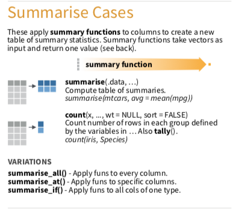

# 敘述統計量Summarise()





> Summary functions take `vectors as input and return one value`，意思就是他會精煉出一個值，可能是某一個變數的平均數等。

#### 介紹兩種用法，summarise/summarise_at{-}

```{r, include=FALSE}
knitr::opts_chunk$set(echo = TRUE, message=FALSE)
```

```{r, echo=FALSE, include=TRUE}
klippy::klippy()
```

```{r, include=FALSE}
library(dplyr)
library(nycflights13)
library(SportsAnalytics)
fetch_NBAPlayerStatistics("17-18") -> NBA1718
```


1. summarise

> 記得要幫你的`summarise`後的結果，取一個變數名稱。這邊是avg_dep_delay。

```{r}
flights %>% summarise(avg_dep_delay = mean(dep_delay), dep_delay_sd = sd(dep_delay))
```

```{r, warning=FALSE}
#為什麼na.rm沒有加上會變成NA?
#na.rm本身是什麼意思？
flights %>% summarise(dep_delay_mean = mean(dep_delay, na.rm = T),
                      arr_delay_mean = mean(arr_delay, na.rm = T),
                      dep_delay_sd = sd(dep_delay, na.rm = T),
                      arr_delay_sd = sd(arr_delay, na.rm = T))
```

2. `summarise_at`意思就是指定幾個變數進行summarise，如果遇到很多個變數的話，會比較方便。
```{r}
#vars，本身是variables的意思，就是要挑哪幾個變數
#funs，本身是functions的意思，就是要執行哪些summary function
flights %>% summarise_at(vars(dep_delay, arr_delay), funs(mean,sd), na.rm = T)
```

3. 上面兩者的結果一樣嗎？

### 範例{-}

> 若完成，請直接貼到open chat

1. 若你是一位賣車的菜鳥業務，為了要知道各車款的優劣勢，想先了解一下這些車，平均有多少汽缸數（cyl, cylinders)，平均有幾匹馬力(hp, Gross horsepower)，你會怎麼做？

```{r, eval=FALSE}
mtcars
```

```{r, echo=FALSE,include=FALSE}
mtcars %>% summarise_at(vars(cyl,hp), funs(mean), na.rm = T)
```

### 自主練習{-}
請問NBA 2017-2018球季，

1. 全體球員平均上場場次為幾場？標準差多少？(上場場次，變數為GamePlayed)

```{r eval=FALSE, include=FALSE}
NBA1718 %>% summarise_at(vars(GamesPlayed), funs(mean, sd))
```


