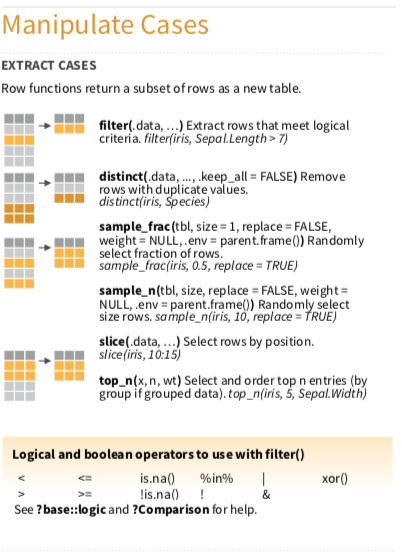

# 篩選適當觀察值filter()



> filter 是針對列(row)做子集合，或者說尋找滿足特定條件的資料點。

```{r, include=FALSE}
knitr::opts_chunk$set(echo = TRUE, message=FALSE)
```

```{r, echo=FALSE, include=TRUE}
klippy::klippy()
```

```{r, include=FALSE}
library(tidyverse)
library(nycflights13)
library(SportsAnalytics)
fetch_NBAPlayerStatistics("17-18") -> NBA1718
```

基本用法
```{r}
#資料集中有336776筆資料
#UA 這家航空公司有58665筆資料
flights %>% filter(carrier == c("UA"))
```

加入logical and boolean operators
```{r}
flights %>% filter(carrier == "UA", dep_delay <= 20 & arr_delay <= 20)
```

做變數計算並作為篩選條件
```{r}
flights %>% filter(carrier == "UA", dep_delay + arr_delay <= 30)
```

### 小練習{-}

1.誰是本季聯盟高耐戰力群？

（標準：出賽場次超過2800分鐘，想法是其全勤也要2800/82 = 34分鐘以上）
```{r, results='hide'}
NBA1718 %>% filter(TotalMinutesPlayed > 2800)
```

2. 休士頓火箭隊本季一共登錄幾名球員？誰應該是該隊的固定先發五人？

Hint: HOU, Houston Rockets

Hint: GamesStarted/GamesPlayed > 0.75
```{r, results='hide'}
NBA1718 %>% filter(Team == "HOU")  %>% filter(GamesStarted/GamesPlayed > 0.75)
```


