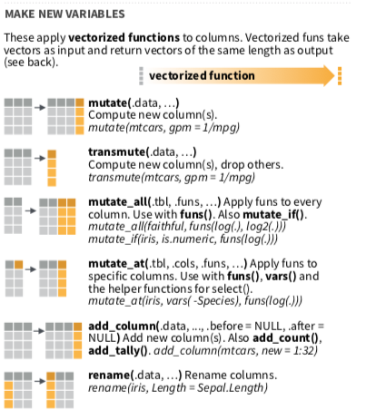
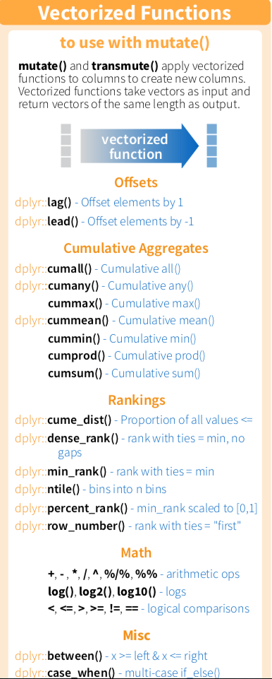

# 從既有變數產生新變數mutate()

<div class="alert white">
cheatsheet截圖對照<a data-toggle="collapse" href="#collapseExample" role="button" aria-expanded="false" aria-controls="collapseExample"><i class="fa fa-image"></i></a>
</div>

```{r, eval=TRUE, echo=FALSE}
library(htmltools)
HTML('
<div class="collapse" id="collapseExample">
<h3>第一部分</h3>

<h3>第二部分</h3>

</div>
     ')
```

#### mutate/transmute，以及mutate+select組合技{-}

> 和summary functions不同的是 : vectorized function，得到的還是一個vector(column vector)

```{r, include=FALSE}
knitr::opts_chunk$set(echo = TRUE, message=FALSE)
```

```{r, echo=FALSE, include=TRUE}
klippy::klippy()
```

```{r, include=FALSE}
library(dplyr)
library(nycflights13)
library(SportsAnalytics)
library(tibble)
fetch_NBAPlayerStatistics("17-18") -> NBA1718
```

1. `mutate`從既有變數中新增變數，有保留原始data.frame。
```{r, warning=FALSE}
flights %>% mutate(total_delay = dep_delay + arr_delay)
```

2. `transmute`從既有變數中新增變數，無保留原始data.frame。
```{r}
flights %>% transmute(total_delay = dep_delay + arr_delay)
```

3. 要怎麼讓新產生的變數，排列到適當的相對位置，不然老是在最右邊？(mutate+select組合技)
```{r}
#我想要讓total_delay，排在arr_delay的旁邊
flights %>% mutate(total_delay = dep_delay + arr_delay) %>% 
            select(year:arr_delay, total_delay, everything())
```

### 範例{-}

> 若完成，請直接貼到open chat

1. 若有一位買家對於這32台車子很有興趣，特別是在省油表現（Miles/(US) gallon, mpg)，以及馬力表現(hp, Gross horsepower)有很大的興趣，你要整理哪些資料？

2. 後來他希望能夠買到馬力性能比較強的車，他要求你將馬力表現高於平均的車款額外整理給他，應該怎麼做呢？

3. 假設這位買家最近試駕了很多台車款，閒聊時候偶然跟你分享他獨家的選車know-how，標準是省油表現（Miles/(US) gallon,mpg)數字的十倍，再加上馬力表現的總和，越高越好，請問哪一台車應該是他的心頭好？

```{r, eval=FALSE}
mtcars
```

```{r, eval=FALSE,include=FALSE}
mtcars %>% select(car_name, mpg, hp) %>% 
           filter(hp > mean(hp, na.rm = T)) %>% 
           mutate(good_cars = mpg*10 + hp)
```

### 自主練習{-}

1. 休士頓火箭隊，隊伍中，本季每個人的場均得分(本季總得分(TotalPoints)/本季出賽場次(GamesPlayed))是多少？

```{r, echo = FALSE, eval=FALSE}
NBA1718 %>% filter(Team == "HOU") %>% mutate(avg_pt = TotalPoints/GamesPlayed) %>% select(League:Position, avg_pt, everything())
```


