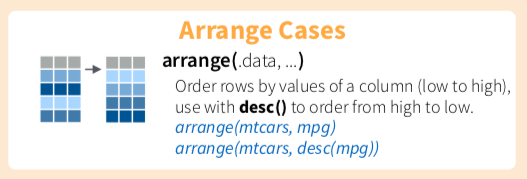

# 排序觀察值arrange()

<div class="alert white">
cheatsheet截圖對照<a data-toggle="collapse" href="#collapseExample" role="button" aria-expanded="false" aria-controls="collapseExample"><i class="fa fa-image"></i></a>
</div>

```{r, eval=TRUE, echo=FALSE}
library(htmltools)
HTML('
<div class="collapse" id="collapseExample">
<h3>第一部分</h3>

</div>
     ')
```

#### 遞增排序，以及遞減排序{-}

```{r, include=FALSE}
knitr::opts_chunk$set(echo = TRUE, message=FALSE)
```

```{r, echo=FALSE, include=TRUE}
klippy::klippy()
```

```{r, include=FALSE}
library(dplyr)
library(nycflights13)
library(SportsAnalytics)
fetch_NBAPlayerStatistics("17-18") -> NBA1718
```

1.預設是由低到高
```{r, warning=FALSE}
flights %>% arrange(dep_delay)
```

2. 加入`desc()`， descending order是遞減，由高到低
```{r}
flights %>% arrange(desc(dep_delay))
```

### 範例{-}

> 若完成，請直接貼到open chat

1. 若有一位買家對於這32台車子很有興趣，特別是在省油表現（Miles/(US) gallon, mpg)，以及馬力表現(hp, Gross horsepower)有很大的興趣，你要整理哪些資料？

2. 後來他希望能夠買到馬力性能比較強的車，他要求你將馬力表現高於平均的車款額外整理給他，應該怎麼做呢？

3. 假設這位買家最近試駕了很多台車款，閒聊時候偶然跟你分享他獨家的選車know-how，標準是省油表現（Miles/(US) gallon,mpg)數字的十倍，再加上馬力表現的總和，越高越好，請問哪一台車應該是他的心頭好？

4. 要成交前，該位買家因為莫名原因心情好，決定要買他挑選標準該數據的前三名，請問你應該給他哪三台車的最終報價？

```{r, eval=FALSE}
mtcars
```

```{r, eval=FALSE,include=FALSE}
mtcars %>% select(mpg, hp) %>% 
           filter(hp > mean(hp, na.rm = T)) %>% 
           mutate(good_cars = mpg*10 + hp) %>% 
           arrange(desc(good_cars))
```

### 自主練習{-}
1. 休士頓火箭隊，隊伍中前三大得分點是誰？

```{r, eval=FALSE, echo=FALSE}
NBA1718 %>% filter(Team == "HOU") %>%
            mutate(avg_points = TotalPoints/GamesPlayed) %>% 
            select(League:GamesPlayed, avg_points) %>% 
            arrange(desc(avg_points))
```

