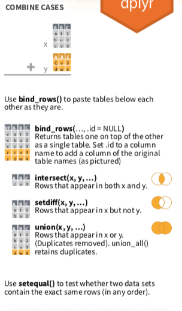
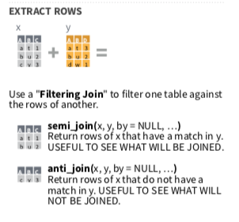

# 合併報表join()






合併data.frame主要可以以column（欄位，變數）角度進行合併，也可以用row（列，觀察值）的角度進行合併。

在兩個資料表以上，或像是爬蟲完畢的資料，彙整進來有時候需要合併報表，才算是完整清理完畢，並進入下一階段。這邊只簡單示範幾個常用的函數與參數。

> (`by` argument In Help) a character vector of variables to join by. If NULL, the default, *_join() will do a natural join, using all variables with common names (共同的變數名)  across the two tables.  (`米字符號＊`是left/right/inner的意思)

- `left_join()`: 以第一個參數x為基準(x資料表裡面的觀測值會全部保留)，將y合併進入x。

- `right_join()`: 以第二個參數y為基準，將x合併進入y (y資料表裡面的觀測值會全部保留)。

- `inner_join()`: 如果沒有設定`by`，函數會比較x,y資料表共同有的變數，然後取兩者相符的列。

- `full-join()`: 會保留所有的觀測值。

> `row`的合併在cheatsheet上比較直觀且清楚，不進行示範。

```{r, include=FALSE}
knitr::opts_chunk$set(echo = TRUE, message=FALSE)
```

```{r, echo=FALSE, include=TRUE}
klippy::klippy()
```

```{r, include=FALSE}
library(dplyr)
```

```{r, eval=FALSE}
band_members
band_instruments
```

```{r}
band_members %>% left_join(band_instruments)
```

```{r}
#兩個資料集皆有name，就算by沒有設定，參數會自動比較有無common names(common variables)，這兩個資料表也只有name一個共同變數。當然有時候共同的變數不只一個。
band_members %>% left_join(band_instruments, by="name")
```

```{r, eval=FALSE}
#會成功嗎？（band_instruments (右邊)資料表沒有band這個變數，無法作為共同的參照基礎，兩者無從比較，是不能的。）
band_members %>% left_join(band_instruments, by="band")
```

```{r, eval=FALSE}
#會成功嗎？(band_members資料表沒有plays這個變數，起初就設定錯誤)
band_members %>% left_join(band_instruments, by="plays")
```


