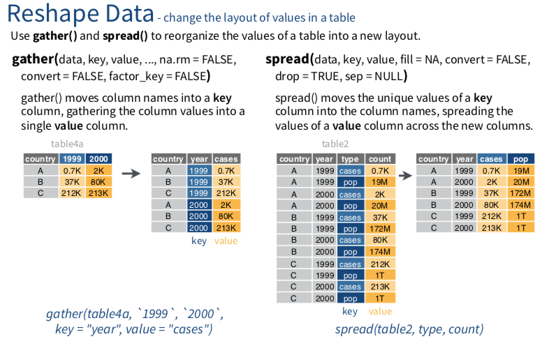

# 其他



#### 行列互相轉換gather()/spread(){-}

```{r, include=FALSE}
knitr::opts_chunk$set(echo = TRUE, message=FALSE)
```

```{r, echo=FALSE, include=TRUE}
klippy::klippy()
```

```{r, include=FALSE}
library(dplyr)
library(nycflights13)
library(SportsAnalytics)
fetch_NBAPlayerStatistics("17-18") -> NBA1718
```

1. gather/spread來自哪一個套件？
```{r, eval=FALSE}
?dplyr #查詢特定套件用一個`?`
??gather #查詢特定函數用兩個`??`
??spread
```

2. 引入需要的套件
```{r, warning=FALSE}
library(tidyr)
```

3. gather()

> gather()函數會將許多欄位變數(column, or variables)，轉化成列(row, or obervations)。<br> 重要參數說明 :<br>
1. key：為原本的欄位變數，其轉換為新的row obervation後，命名該新增欄位的名稱。<br>
2. value：為原本的欄位變數的觀察值(obervations)，命名其新欄位的名字<br>

請問這兩段程式碼結果有什麼不同？（請用css或者數量方法的開合）
```{r}
flights %>% select(year:day, dep_delay)
```

```{r}
flights %>% select(year:day, dep_delay) %>% 
            gather(dep_delay, key = "departure", value = "number")

```

### 範例{-}

1. 延續上一題，若該位總管，除了重視防守之外，他也很重視球員耐戰程度，假設整個球季上場就過2500分鐘可以視為高耐戰族群，要怎麼做才能知道有哪些球員？

```{r, results='hide'}
NBA1718 %>% select(League:Position, 
                   TotalMinutesPlayed, 
                   TotalRebounds,Steals) %>%
            filter(TotalMinutesPlayed > 2500)
```

### 小練習{-}

> 若完成，請直接貼到open chat

1. 若有一位買家對於這32台車子很有興趣，特別是在省油表現（Miles/(US) gallon, mpg)，以及馬力表現(hp, Gross horsepower)有很大的興趣，你要整理哪些資料？

2. 後來他希望能夠買到馬力性能比較強的車，他要求你將馬力表現高於平均的車款額外整理給他，應該怎麼做呢？

```{r, eval=FALSE}
mtcars
```

```{r, eval=FALSE,include=FALSE}
mtcars %>% select(mpg, hp) %>% filter(hp > mean(hp, na.rm = T))
```


