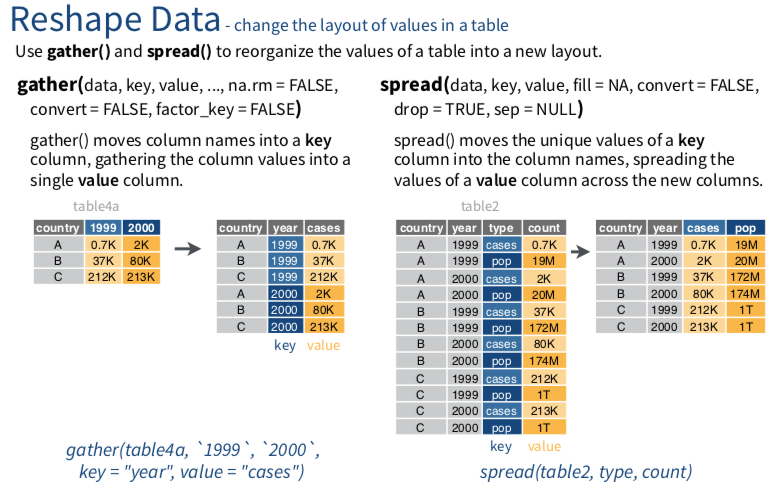

# 其他

<div class="alert white">
cheatsheet截圖對照<a data-toggle="collapse" href="#collapseExample" role="button" aria-expanded="false" aria-controls="collapseExample"><i class="fa fa-image"></i></a>
</div>

```{r, eval=TRUE, echo=FALSE}
library(htmltools)
HTML('
<div class="collapse" id="collapseExample">
<h3>第一部分</h3>

</div>
     ')
```

### 行列互相轉換gather()/spread(){-}

```{r, include=FALSE}
knitr::opts_chunk$set(echo = TRUE, message=FALSE)
```

```{r, echo=FALSE, include=TRUE}
klippy::klippy()
```

```{r, include=FALSE}
library(dplyr)
library(nycflights13)
library(SportsAnalytics)
library(tibble)
fetch_NBAPlayerStatistics("17-18") -> NBA1718
```

1. gather/spread來自哪一個套件？
```{r, eval=FALSE}
?dplyr #查詢特定套件用一個`?`
??gather #查詢特定函數用兩個`??`
??spread
```

2. 引入需要的套件
```{r, warning=FALSE}
library(tidyr)
```

#### gather() {-}

> gather()函數會將許多欄位變數(column, or variables)，轉化成列(row, or obervations)。<br> 重要參數說明 :<br>
1. key：為「原本的欄位變數」，其轉換為row obervation後，命名該新增欄位的名稱。<br>
2. value：為「原本的欄位變數」的觀察值(obervations)，命名其新欄位的名字。<br>

請問這兩段程式碼結果有什麼不同？
```{r, warning=FALSE}
#總共有336,776 rows
flights %>% select(year:day, dep_delay, arr_delay, flight:tailnum)
```

```{r}
#總共有673,552 rows
flights %>% select(year:day, dep_delay, arr_delay, flight:tailnum) %>%   gather(c(dep_delay,arr_delay), key = "the_delay", value = "minutes")
```

```{r, warning=FALSE}
flights %>% select(year:day, dep_delay, arr_delay, flight:tailnum) %>% gather(c(dep_delay,arr_delay), key = "the_delay", value = "minutes") %>% filter(flight == 1545, tailnum == "N14228")          
```

#### spread() {-}

```{r, results='hide'}
#先另存成一個新物件flights1方便後續操作。
flights %>% select(year:day, dep_delay, arr_delay, flight:tailnum)               %>% gather(c(dep_delay,arr_delay), key = "the_delay", value = "minutes") -> flights1
```

> 基本上spread()與gather()，目的相反。將列(row, or obervations)，轉化成欄位變數(column, or variables) <br> 重要參數說明 :<br>
1. key：挑選要將哪一個欄位變數「其obversation內容」轉換為「新欄位變數」，新欄位名稱即為原本的obervation內容。<br>
2. value：挑選要將哪一個欄位變數「其obversation內容」設定為新產生的欄位變數的內容。<br>

1. 下列兩段程式碼有什麼不同？哪一個可以運作成功？

```{r, eval=FALSE}
flights1 %>% spread(key = "the_delay", value = "minutes")
```

> 使用spread的過程中，如果要轉成欄位的該觀測值(obervations)，沒有某一個欄位變數可以一對一對應的話(be unique)，轉換就會失敗。所以可以新增一行unique index column。

相關資料參考[^1]

```{r, eval=FALSE}
flights1 %>% group_by(the_delay) %>% 
             mutate(grouped_id = row_number())
```

```{r}
flights1 %>% group_by(the_delay) %>% 
             mutate(grouped_id = row_number()) %>%
             spread(key = "the_delay",value = "minutes") %>% 
             select(-grouped_id)
```

[^1]:[Workaround for tidyr::spread with duplicate row identifiers on R-bloggers](https://www.r-bloggers.com/workaround-for-tidyrspread-with-duplicate-row-identifiers/)


