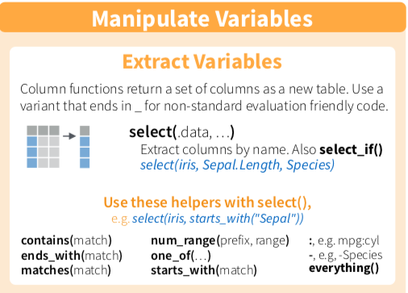
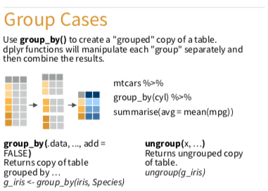

--- 
title: "R_Dplyr_minicourse"
author: "陳柏銘PoMingChen"
date: "`r Sys.Date()`"
description: E.Major R_Dplyr_minicourse
documentclass: ctexbook
geometry:
- b5paper
- tmargin=2.5cm
- bmargin=2.5cm
- lmargin=3.5cm
- rmargin=2.5cm
link-citations: yes
lof: yes
lot: yes
site: bookdown::bookdown_site
colorlinks: yes
---

```{r setup, include=FALSE}
options(
  htmltools.dir.version = FALSE, formatR.indent = 2, width = 55, digits = 4
)

lapply(c(), function(pkg) {
  if (system.file(package = pkg) == '') install.packages(pkg)
})

knitr::opts_chunk$set(message=FALSE,
                      echo=FALSE,
                      fig.showtext=TRUE)
library(showtext)
showtext_auto()
```

# 課程規劃 

## 前言 {-}   

Dplyr是R語言當中相當重要的資料處理套件，同時也是跨出探索式資料分析的第一步。

探索式資料分析是透過視覺化或敘述統計的方式，去觀察資料本身的特性或者變數與變數之間的關聯，以求對資料有更多的認識，看看是否有意外有趣的發現或者不符合常理的地方。當然也包含資料清理與建立必要變數的部分，必要時需要透過爬蟲或者引入第三方資料，才算完整。

資料處理做得好，整體的分析方向和後面的統計建模才會有意義且往對的道路前進，以避免不必要的時間、資源浪費。

## 課前要求 {-}  

1. 安裝：R and R Studio Desktop: https://www.rstudio.com  
2. [下載dplyr cheatsheet](https://github.com/rstudio/cheatsheets/raw/master/data-transformation.pdf) 
3. 註冊[hypothes.is](https://web.hypothes.is)，並點選以下連結加入討論群：https://hypothes.is/groups/YX79arq3/minicourse-dplyr
4. 安裝[Chrome瀏覽器](https://www.google.com/chrome/)
5. 安裝[hypothes.is extension for Chrome](https://chrome.google.com/webstore/search/hypothesis?hl=en)
6. 註冊[Github](https://github.com)
7. 安裝[Github Desktop](https://desktop.github.com)

## 課程大綱 {-} 

> 本課程將逐步介紹Dplyr常用的分析資料函數，會搭配dplyr cheatsheet以及Help做講解，希望能夠在熟悉基本工具之後，未來甚至不需要這本電子書就能夠用效率的方式使用Dplyr。

以下為講解的資料整理函數(4 + 4）：

- 認識資料基本資訊

  - `head`、`Str`、`rename`、`?`
  
- 計算敘述統計量

  - `summarise`

- 挑選適當的欄位

  - `select`

- 篩選適當觀察值

  - `filter`

- 從既有變數產生新變數

  - `mutate`

- 排序觀察值

  - `arrange`
  
- 分群分析

  - `group_by`
  
- 其他、

  - `gather/spread`

<!--chapter:end:index.Rmd-->

# 環境設定與基本觀察

```{r, include=FALSE}
knitr::opts_chunk$set(echo = TRUE, message=FALSE)
```

```{r klippy, echo=FALSE, include=TRUE}
klippy::klippy()
```

### 引入需要用到的套件{-}
```{r warning=FALSE}
#library(tidyverse)
library(dplyr)
library(nycflights13)
library(SportsAnalytics)
fetch_NBAPlayerStatistics("17-18") -> NBA1718
# 若無法成功，請先下載套件。
# 我們只要觀察2017-2018球季的資料。
```

#### 引入資料{-}
```{r, results='hide'}
flights
NBA1718
```

### 基本觀察函數{-}

在「探索式資料分析」我們一定會需要去認識資料型態（Data type)，以及變數本身定義（涉及到Domain Knowledge）。

基本上四大資料型態有`numeric(數值)`，`interger(整數)`，`character(字串)`，`logic(布林變數)`。

這邊一共要介紹：`?`、`head()` 、`str()`、`rename`

1. `?`的功能與RStudio介面中，直接查詢Help是一樣的。基本上包含套件、函數、資料集都可以查詢。
```{r}
?flights
?dplyr
```

2. `head`函數會顯示資料集的前六筆資料。
```{r}
head(flights)
```

3. `str`函數則是以條列式來概覽整個資料集。
```{r}
str(flights)
```

4. `rename`，可以將更改變數名稱，增加易讀性，不然有時候變數名稱很長。
```{r}
#新變數名稱（放左邊）= 舊的變數名稱
flights %>% rename(total_distance = distance)
```

### 範例{-}

> 若完成，請直接貼到open chat

1. 請用`?`查詢他是一個怎麼樣的資料集？
2. 請用`str`或者`head`函數，觀察他哪些資料型態的變數較多？
3. 請用`rename`更改變數hp，變成horsepower

```{r, eval=FALSE}
mtcars
```

```{r, echo=FALSE,include=FALSE}
?mtcars
```

```{r, echo=FALSE,include=FALSE}
str(mtcars)
```

```{r, echo=FALSE,include=FALSE}
mtcars %>% rename(horsepower = hp)
```

### 自主練習{-}

1. 請問(NBA1718)這個資料集裡面哪一種Data Type最多？
```{r, eval=FALSE,echo=FALSE}
str(NBA1718)
```

2. 其中一個變數，GamesStarted，是指該球員先發場次，我覺得把它改成Games_Started較佳，請問該怎麼做？
```{r, eval=FALSE,echo=FALSE}
NBA1718 %>% rename(Games_Started = GamesStarted)
```

<!--chapter:end:01-BasicInfo.Rmd-->

# 敘述統計量Summarise()


> Summary functions take `vectors as input and return one value`，意思就是他會精煉出一個值，可能是某一個變數的平均數等。

#### 介紹兩種用法，summarise/summarise_at{-}

```{r, include=FALSE}
knitr::opts_chunk$set(echo = TRUE, message=FALSE)
```

```{r, echo=FALSE, include=TRUE}
klippy::klippy()
```

```{r, include=FALSE}
library(dplyr)
library(nycflights13)
library(SportsAnalytics)
fetch_NBAPlayerStatistics("17-18") -> NBA1718
```


1. summarise
> 記得要幫你的`summarise`後的結果，取一個變數名稱。這邊是avg_dep_delay。

```{r}
flights %>% summarise(avg_dep_delay = mean(dep_delay), dep_delay_sd = sd(dep_delay))
```

```{r, warning=FALSE}
#為什麼na.rm沒有加上會變成NA?
#na.rm本身是什麼意思？
flights %>% summarise(dep_delay_mean = mean(dep_delay, na.rm = T),
                      arr_delay_mean = mean(arr_delay, na.rm = T),
                      dep_delay_sd = sd(dep_delay, na.rm = T),
                      arr_delay_sd = sd(arr_delay, na.rm = T))
```

2. `summarise_at`意思就是指定幾個變數進行summarise，如果遇到很多個變數的話，會比較方便。
```{r}
#vars，本身是variables的意思，就是要挑哪幾個變數
#funs，本身是functions的意思，就是要執行哪些summary function
flights %>% summarise_at(vars(dep_delay, arr_delay), funs(mean,sd), na.rm = T)
```

3. 上面兩者的結果一樣嗎？

### 範例{-}

> 若完成，請直接貼到open chat

1. 若你是一位賣車的菜鳥業務，為了要知道各車款的優劣勢，想先了解一下這些車，平均有多少汽缸數（cyl, cylinders)，平均有幾匹馬力(hp, Gross horsepower)，你會怎麼做？

```{r, eval=FALSE}
mtcars
```

```{r, echo=FALSE,include=FALSE}
mtcars %>% summarise_at(vars(cyl,hp), funs(mean), na.rm = T)
```

### 自主練習{-}
請問NBA 2017-2018球季，

1. 全體球員平均上場場次為幾場？標準差多少？(上場場次，變數為GamePlayed)

```{r eval=FALSE, include=FALSE}
NBA1718 %>% summarise_at(vars(GamesPlayed), funs(mean, sd))
```


<!--chapter:end:02-Summarise.Rmd-->

# 挑選適當的欄位Select()



#### Select 是針對欄位(variables)做子集合{-}

```{r, include=FALSE}
knitr::opts_chunk$set(echo = TRUE, message=FALSE)
```

```{r, echo=FALSE, include=TRUE}
klippy::klippy()
```

```{r, include=FALSE}
library(dplyr)
library(nycflights13)
library(SportsAnalytics)
fetch_NBAPlayerStatistics("17-18") -> NBA1718
```


1. 基本取法
```{r}
#若我想看每一個航班的基本資料，包含起飛與目的地
flights %>% select(year,month,day,carrier,flight,tailnum,origin,dest)
```

2. 取連續某幾行的欄位
```{r}
#跟上面的寫法，有什麼異同？
flights %>% select(year:day,carrier:dest)
```

3. 取特定類型的欄位
```{r}
#若我有想看有關起飛與抵達的資料，contains()，就能派上用場，當然也有其他內容，請參考cheatsheet
flights %>% select(contains("dep"), contains("arr"))
```

4. 去掉某些變數(drop certain variables)
```{r}
#若我留意有些變數，對後續分析沒有幫助...
flights %>% select(-c(time_hour))
```

```{r}
#一次可以去掉多個變數嗎？
flights %>% select(-c(time_hour,tailnum,flight))
```

5. everthing()
```{r}
#everything()，意思是all variables的意思。
#稍等與mutate()一起使用可以提升資料整理的效率性。
flights %>% select(everything())
```

### 範例{-}

> 若完成，請直接貼到open chat

1. 若有一位買家對於這32台車子很有興趣，特別是在省油表現（Miles/(US) gallon, mpg)，以及馬力表現(hp, Gross horsepower)有很大的興趣，你要怎麼整理資料給他？

```{r, eval=FALSE}
mtcars
```

```{r, echo=FALSE,include=FALSE}
mtcars %>% select(mpg, hp)
```

### 自主練習{-}

1. 若有一名球隊總管，很重視防守，他想要概覽一下聯盟中誰防守比較好。需要其名字(Name)、所屬隊伍(Team)、守備位置(Position)， 他搶了幾個籃板球(TotalRebounds),有幾次抄球 (Steals)，請問應該怎麼撈資料？

```{r, echo=FALSE,include=FALSE}
NBA1718 %>% select(League:Position, TotalRebounds,Steals)
```


<!--chapter:end:03-Select.Rmd-->

# 篩選適當觀察值filter()


#### filter 是針對列(row)，或者說觀察值(obervations)，做子集合，目的是尋找滿足特定條件的資料點{-}

```{r, include=FALSE}
knitr::opts_chunk$set(echo = TRUE, message=FALSE)
```

```{r, echo=FALSE, include=TRUE}
klippy::klippy()
```

```{r, include=FALSE}
library(dplyr)
library(nycflights13)
library(SportsAnalytics)
fetch_NBAPlayerStatistics("17-18") -> NBA1718
```

1. 基本用法
```{r, warning=FALSE}
flights %>% filter(month==1, day==2)
```

2. 加入logical and boolean operators

> 眾多logical and boolean operators，請參考cheatsheet

```{r}
flights %>% filter(dep_delay <= 20 & arr_delay <= 20)
```

3. 做變數計算並作為篩選條件
```{r}
flights %>% filter(dep_delay + arr_delay <= 30)
```

4. 看起來比較特別的%in%，是什麼？
```{r}
#基本理解是：是否出現該字眼，或者説是否包含於。
#在字串變數(character)的挑選，以及其他字串操作上很常用
flights %>% filter(carrier %in% c("UA","US"), dep_delay + arr_delay <= 30)
```

### 範例{-}

> 若完成，請直接貼到open chat

1. 若有一位買家對於這32台車子很有興趣，特別是在省油表現（Miles/(US) gallon, mpg)，以及馬力表現(hp, Gross horsepower)有很大的興趣，你要整理哪些資料？

2. 後來他希望能夠買到馬力性能比較強的車，他要求你將馬力表現高於平均的車款額外整理給他，應該怎麼做呢？

```{r, eval=FALSE}
mtcars
```

```{r, eval=FALSE,include=FALSE}
mtcars %>% select(mpg, hp) %>% filter(hp > mean(hp, na.rm = T))
```

### 自主練習{-}

1. 延續上一題，若該位總管，除了重視防守之外，他也很重視球員耐戰程度，假設整個球季上場就過2500分鐘可以視為高耐戰族群，要怎麼做才能知道有哪些球員？

```{r, echo=FALSE, eval=FALSE}
NBA1718 %>% select(League:Position, 
                   TotalMinutesPlayed, 
                   TotalRebounds,Steals) %>%
            filter(TotalMinutesPlayed > 2500)
```

<!--chapter:end:04-Filter.Rmd-->

# 從既有變數產生新變數mutate()


#### mutate/transmute，以及mutate+select組合技{-}


> 和summary functions不同的是 : vectorized function，得到的還是一個vector(column vector)

```{r, include=FALSE}
knitr::opts_chunk$set(echo = TRUE, message=FALSE)
```

```{r, echo=FALSE, include=TRUE}
klippy::klippy()
```

```{r, include=FALSE}
library(dplyr)
library(nycflights13)
library(SportsAnalytics)
fetch_NBAPlayerStatistics("17-18") -> NBA1718
```

1. `mutate`從既有變數中新增變數，有保留原始data.frame。
```{r, warning=FALSE}
flights %>% mutate(total_delay = dep_delay + arr_delay)
```

2. `transmute`從既有變數中新增變數，無保留原始data.frame。
```{r}
flights %>% transmute(total_delay = dep_delay + arr_delay)
```

3. 要怎麼讓新產生的變數，排列到適當的相對位置，不然老是在最右邊？(mutate+select組合技)
```{r}
#我想要讓total_delay，排在arr_delay的旁邊
flights %>% mutate(total_delay = dep_delay + arr_delay) %>% 
            select(year:arr_delay, total_delay, everything())
```

### 範例{-}

> 若完成，請直接貼到open chat

1. 若有一位買家對於這32台車子很有興趣，特別是在省油表現（Miles/(US) gallon, mpg)，以及馬力表現(hp, Gross horsepower)有很大的興趣，你要整理哪些資料？

2. 後來他希望能夠買到馬力性能比較強的車，他要求你將馬力表現高於平均的車款額外整理給他，應該怎麼做呢？

3. 假設這位買家最近試駕了很多台車款，閒聊時候偶然跟你分享他獨家的選車know-how，標準是省油表現（Miles/(US) gallon,mpg)數字的十倍，再加上馬力表現的總和，越高越好，請問哪一台車應該是他的心頭好？

```{r, eval=FALSE}
mtcars
```

```{r, eval=FALSE,include=FALSE}
mtcars %>% select(mpg, hp) %>% 
           filter(hp > mean(hp, na.rm = T)) %>% 
           mutate(good_cars = mpg*10 + hp)
```

### 自主練習{-}

1. 休士頓火箭隊，隊伍中，本季每個人的場均得分(本季總得分(TotalPoints)/本季出賽場次(GamesPlayed))是多少？

```{r, echo = FALSE, eval=FALSE}
NBA1718 %>% filter(Team == "HOU") %>% mutate(avg_pt = TotalPoints/GamesPlayed) %>% select(League:Position, avg_pt, everything())
```


<!--chapter:end:05-mutate.Rmd-->

# 排序觀察值arrange()


#### 遞增排序，以及遞減排序{-}

```{r, include=FALSE}
knitr::opts_chunk$set(echo = TRUE, message=FALSE)
```

```{r, echo=FALSE, include=TRUE}
klippy::klippy()
```

```{r, include=FALSE}
library(dplyr)
library(nycflights13)
library(SportsAnalytics)
fetch_NBAPlayerStatistics("17-18") -> NBA1718
```

1.預設是由低到高
```{r, warning=FALSE}
flights %>% arrange(dep_delay)
```

2. 加入`desc()`， descending order是遞減，由高到低
```{r}
flights %>% arrange(desc(dep_delay))
```

### 範例{-}

> 若完成，請直接貼到open chat

1. 若有一位買家對於這32台車子很有興趣，特別是在省油表現（Miles/(US) gallon, mpg)，以及馬力表現(hp, Gross horsepower)有很大的興趣，你要整理哪些資料？

2. 後來他希望能夠買到馬力性能比較強的車，他要求你將馬力表現高於平均的車款額外整理給他，應該怎麼做呢？

3. 假設這位買家最近試駕了很多台車款，閒聊時候偶然跟你分享他獨家的選車know-how，標準是省油表現（Miles/(US) gallon,mpg)數字的十倍，再加上馬力表現的總和，越高越好，請問哪一台車應該是他的心頭好？

4. 要成交前，該位買家因為莫名原因心情好，決定要買他挑選標準該數據的前三名，請問你應該給他哪三台車的最終報價？

```{r, eval=FALSE}
mtcars
```

```{r, eval=FALSE,include=FALSE}
mtcars %>% select(mpg, hp) %>% 
           filter(hp > mean(hp, na.rm = T)) %>% 
           mutate(good_cars = mpg*10 + hp) %>% 
           arrange(desc(good_cars))
```

### 自主練習{-}
1. 休士頓火箭隊，隊伍中前三大得分點是誰？

```{r, eval=FALSE, echo=FALSE}
NBA1718 %>% filter(Team == "HOU") %>%
            mutate(avg_points = TotalPoints/GamesPlayed) %>% 
            select(League:GamesPlayed, avg_points) %>% 
            arrange(desc(avg_points))
```


<!--chapter:end:06-arrange.Rmd-->

# 分群分析group_by()



#### 分群分析與群內排序{-}

> `group_by()`函數會由原本資料集產生一個新的分群過的資料集，通常會與`summarise`函數一起運用。可以直接理解為group by certain variable。

```{r, include=FALSE}
knitr::opts_chunk$set(echo = TRUE, message=FALSE)
```

```{r, echo=FALSE, include=TRUE}
klippy::klippy()
```

```{r, include=FALSE}
library(dplyr)
library(nycflights13)
library(SportsAnalytics)
fetch_NBAPlayerStatistics("17-18") -> NBA1718
```

1. 用group_by函數看看「哪一家航空公司(carrier)」的「平均起飛延遲」最嚴重？
```{r, warning=FALSE}
flights %>% group_by(carrier) %>% 
            summarise_at(vars(dep_delay), funs(mean), na.rm = T) %>% 
            arrange(desc(dep_delay)) %>% rename(dep_delay_mean = dep_delay)
```
  
2. 可以設定多個分組依據
```{r}
# 我想要知道個別`航空公司(carrier) `，哪些`航班路線(Flight number)`起飛通常比較容易遇到延遲？
flights %>% group_by(carrier, flight) %>% 
            summarise_at(vars(dep_delay), funs(mean), na.rm = T) %>% 
            arrange(desc(dep_delay)) %>% rename(dep_delay_mean = dep_delay)
```

3. 我想要知道1~12月份，「各月份」的「每一天」，航班「平均起飛延遲」嚴重程度？（group_by + arrange組合技）
```{r}
#意思就是，群內（或者說組內）排序怎麼做？
#請查詢 Help，重點是arrange函數裡面的 .by_group 參數
flights %>% group_by(month, day) %>% 
            summarise_at(vars(dep_delay), funs(mean), na.rm = T) %>% 
            arrange(desc(dep_delay), .by_group = T)

#那要怎麼進一步撈出各個月各天的起飛延誤前三名呢？是不是filter_at/filter_if?
```

### 範例{-}

> 若完成，請直接貼到open chat

1. 若有一位買家對於這32台車子很有興趣，特別是在省油表現（Miles/(US) gallon, mpg)，以及馬力表現(hp, Gross horsepower)有很大的興趣，你要整理哪些資料？

2. 後來他希望能夠買到馬力性能比較強的車，他要求你將馬力表現高於平均的車款額外整理給他，應該怎麼做呢？

3. 假設這位買家最近試駕了很多台車款，閒聊時候偶然跟你分享他獨家的選車know-how，標準是省油表現（Miles/(US) gallon,mpg)數字的十倍，再加上馬力表現的總和，越高越好，請問哪一台車應該是他的心頭好？

4. 要成交前，該位買家因為莫名原因心情好，決定要買他挑選標準該數據的前三名，請問你應該給他哪三台車的最終報價？

5. 服務完這位客戶後，發現自己累積了不少經驗，也留意到汽缸數多寡與馬力有一定關聯性，閒來之餘想要整理一下相同汽缸數下，不同車款的馬力比較表作為往後參考，請問該怎麼做？

```{r, eval=FALSE}
mtcars
```

```{r, eval=FALSE,include=FALSE}
mtcars %>% group_by(cyl) %>% arrange(desc(hp), .by_group = T)
```

### 自主練習{-}

1. (延續上一題）休士頓火箭隊，各個守備位置各有多少人？

> 1. 隊(Team)、守備位置(Position)是兩個分組條件<br>
  2. 計算row（或者說樣本個數），可以用n(), number of values/rows，可參考dplyr cheatsheet

```{r, eval=FALSE,include=FALSE}
NBA1718 %>% group_by(Team, Position) %>% summarise(nPlayer = n()) %>% filter(Team == "HOU")
```


<!--chapter:end:07-Group_by.Rmd-->

# 其他


### 行列互相轉換gather()/spread(){-}

```{r, include=FALSE}
knitr::opts_chunk$set(echo = TRUE, message=FALSE)
```

```{r, echo=FALSE, include=TRUE}
klippy::klippy()
```

```{r, include=FALSE}
library(dplyr)
library(nycflights13)
library(SportsAnalytics)
fetch_NBAPlayerStatistics("17-18") -> NBA1718
```

1. gather/spread來自哪一個套件？
```{r, eval=FALSE}
?dplyr #查詢特定套件用一個`?`
??gather #查詢特定函數用兩個`??`
??spread
```

2. 引入需要的套件
```{r, warning=FALSE}
library(tidyr)
```

#### gather() {-}

> gather()函數會將許多欄位變數(column, or variables)，轉化成列(row, or obervations)。<br> 重要參數說明 :<br>
1. key：為「原本的欄位變數」，其轉換為row obervation後，命名該新增欄位的名稱。<br>
2. value：為「原本的欄位變數」的觀察值(obervations)，命名其新欄位的名字。<br>

請問這兩段程式碼結果有什麼不同？（請用css或者數量方法的開合）
```{r}
flights %>% select(year:day, dep_delay)
```

```{r}
flights %>% select(year:day, dep_delay) %>% 
            gather(dep_delay, key = "departure_delay", value = "number")
```

#### spread() {-}

```{r, results='hide'}
#先另存成一個新物件方便後續操作。
flights %>% select(year:day, dep_delay) %>% 
            gather(dep_delay, key = "departure_delay", value = "number") -> flights1
```

> 基本上spread()與gather()，目的相反。將列(row, or obervations)，轉化成欄位變數(column, or variables) <br> 重要參數說明 :<br>
1. key：挑選要將哪一個欄位變數「其obversation內容」轉換為「新欄位變數」，新欄位名稱即為原本的obervation內容。<br>
2. value：挑選要將哪一個欄位變數「其obversation內容」設定為新產生的欄位變數的內容。<br>

1. 下列兩段程式碼有什麼不同？哪一個可以運作成功？

> 使用spread的過程中，如果要轉成欄位的該觀測值(obervations)，沒有某一個欄位變數可以一對一對應的話(be unique)，轉換就會失敗。所以可以新增一行unique index column。

相關資料參考[^1]

```{r, eval=FALSE}
flights1 %>% spread(key = departure_delay, value = number)
```

```{r}
flights1 %>% group_by(departure_delay) %>% mutate(grouped_id = row_number()) %>%
  spread(departure_delay, number) %>% select(-grouped_id)
```


[^1]:[Workaround for tidyr::spread with duplicate row identifiers on R-bloggers](https://www.r-bloggers.com/workaround-for-tidyrspread-with-duplicate-row-identifiers/)


<!--chapter:end:09-others.Rmd-->

# 參考資料

[林茂廷老師dplyr用書](https://bookdown.org/tpemartin/dplyr_intro/section-1.html)

[r4ds](http://r4ds.had.co.nz/introduction.html)

[長庚大學資管系大數據分析方法課程教學用書](https://yijutseng.github.io/DataScienceRBook/)

[推薦活動：Taiwan R user group meetup](https://www.meetup.com/Taiwan-R/)

[推薦文章：Tidyverse，學習R語言的新起點](https://getpocket.com/a/read/1967425863)

<!--chapter:end:10-Reference.Rmd-->

