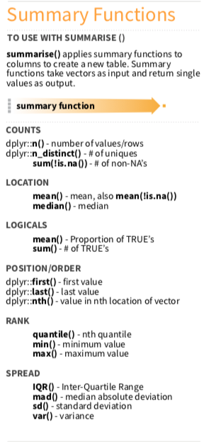
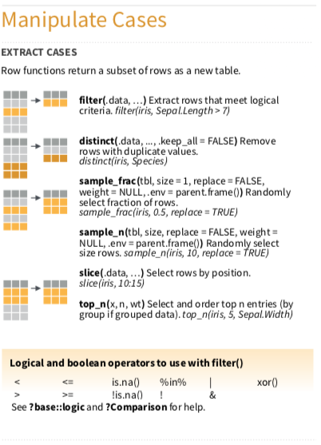
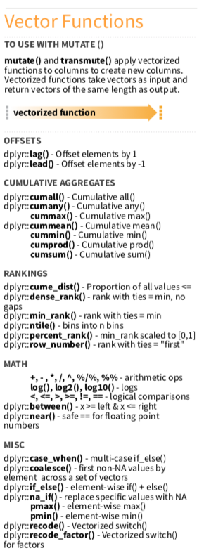
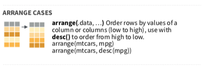

--- 
title: "R_Dplyr_minicourse"
author: "陳柏銘PoMingChen"
date: "`r Sys.Date()`"
description: E.Major R_Dplyr_minicourse
documentclass: ctexbook
geometry:
- b5paper
- tmargin=2.5cm
- bmargin=2.5cm
- lmargin=3.5cm
- rmargin=2.5cm
link-citations: yes
lof: yes
lot: yes
site: bookdown::bookdown_site
colorlinks: yes
---

```{r setup, include=FALSE}
options(
  htmltools.dir.version = FALSE, formatR.indent = 2, width = 55, digits = 4
)

lapply(c(), function(pkg) {
  if (system.file(package = pkg) == '') install.packages(pkg)
})

knitr::opts_chunk$set(message=FALSE,
                      echo=FALSE,
                      fig.showtext=TRUE)
library(showtext)
showtext_auto()
```

# 課程規劃 

## 前言 {-}   

Dplyr是R語言當中相當重要的資料處理套件，同時也是跨出探索式資料分析的第一步。

探索式資料分析是透過視覺化或敘述統計的方式，去觀察資料本身的特性或者變數與變數之間的關聯，以求對資料有更多的認識，看看是否有意外有趣的發現或者不符合常理的地方。當然也包含資料清理與建立必要變數的部分，必要時需要透過爬蟲或者引入第三方資料，才算完整。

資料處理做得好，整體的分析方向和後面的統計建模才會有意義且往對的道路前進，以避免不必要的時間、資源浪費。

## 課前要求 {-}  

1. 安裝：R and R Studio Desktop: https://www.rstudio.com  
2. [下載dplyr cheatsheet](https://github.com/rstudio/cheatsheets/raw/master/data-transformation.pdf) 
3. 註冊[hypothes.is](https://web.hypothes.is)，並點選以下連結加入討論群：https://hypothes.is/groups/YX79arq3/minicourse-dplyr
4. 安裝[Chrome瀏覽器](https://www.google.com/chrome/)
5. 安裝[hypothes.is extension for Chrome](https://chrome.google.com/webstore/search/hypothesis?hl=en)
6. 註冊[Github](https://github.com)
7. 安裝[Github Desktop](https://desktop.github.com)

## 課程大綱 {-} 

> 本課程將逐步介紹Dplyr常用的分析資料函數，會搭配dplyr cheatsheet以及Help做講解，希望能夠在熟悉基本工具之後，未來甚至不需要這本電子書就能夠用效率的方式使用Dplyr。

以下為講解的資料整理函數(4 + 4）：

- 認識資料基本資訊

  - `View`、`Str`
  
- 計算敘述統計量

  - `summarise`

- 挑選適當的欄位

  - `select`

- 篩選適當觀察值

  - `filter`

- 從既有變數產生新變數

  - `mutate`

- 分群分析

  - `group`

- 排序觀察值

  - `arrange`
  
- 合併報表

  - `join`

<!--chapter:end:index.Rmd-->

# 環境設定與基本觀察

```{r, include=FALSE}
knitr::opts_chunk$set(echo = TRUE, message=FALSE)
```

```{r klippy, echo=FALSE, include=TRUE}
klippy::klippy()
```

### 引入需要用到的套件{-}
```{r}
library(tidyverse)
library(nycflights13)
library(SportsAnalytics)
fetch_NBAPlayerStatistics("17-18") -> NBA1718
# 若無法成功，請先下載套件。
# 我們只要觀察2017-2018球季的資料。
```

### 引入資料{-}
```{r, results='hide'}
flights
NBA1718
```

### 基本觀察函數{-}

在「探索式資料分析」我們一定會需要去認識資料型態（Data type)，以及變數本身定義（涉及到Domain Knowledge）。

基本上四大資料型態有`numeric(數值)`，`interger(整數)`，`character(字串)`，`logic(布林變數)`。

這邊要介紹兩個常用的函數：`head()` `str()`
```{r}
?flights
head(flights)
str(flights)
```

### 小練習{-}

1. 請問(NBA1718)這個資料集裡面哪一種Data Type最多？
2. Steve Adams本季出賽場次為幾場？
```{r, results='hide'}
str(NBA1718)
```

```{r, results='hide'}
head(NBA1718)
```


<!--chapter:end:01-BasicInfo.Rmd-->

# 敘述統計量Summarise()




> Summary functions take `vectors as input and return one value`

> (the arguments (...) In Help) `The name will be the name of the variable in the result.` The value should be an expression that returns a single value like min(x), n(), or sum(is.na(y)).

```{r, include=FALSE}
knitr::opts_chunk$set(echo = TRUE, message=FALSE)
```

```{r, echo=FALSE, include=TRUE}
klippy::klippy()
```

```{r, include=FALSE}
library(tidyverse)
library(nycflights13)
library(SportsAnalytics)
fetch_NBAPlayerStatistics("17-18") -> NBA1718
```

```{r}
flights %>% summarise(avg_dep_delay = mean(dep_delay), dep_delay_sd = sd(dep_delay))
```

```{r}
#為什麼na.rm沒有加上會變成NA?
flights %>% summarise(avg_dep_delay = mean(dep_delay, na.rm = T), dep_delay_sd = sd(dep_delay, na.rm = T))
```

```{r}
flights %>% summarise(IQR_dep_delay = IQR(dep_delay, na.rm = T), max_dep_delay = max(dep_delay, na.rm = T))
```

### 小練習{-}
1. 請問NBA 2017-2018球季，全體球員平均上場場次為幾場？標準差多少？

Hint:上場場次，變數為GamePlayed

```{r, results='hide'}
NBA1718 %>% summarise(avg_GamePlayed = mean(GamesPlayed), sd_GamePlayed = sd(GamesPlayed))
```


<!--chapter:end:02-Summarise.Rmd-->

# 挑選適當的欄位Select()


> Select 是針對欄位(variables)做子集合

```{r, include=FALSE}
knitr::opts_chunk$set(echo = TRUE, message=FALSE)
```

```{r, echo=FALSE, include=TRUE}
klippy::klippy()
```

```{r, include=FALSE}
library(tidyverse)
library(nycflights13)
library(SportsAnalytics)
fetch_NBAPlayerStatistics("17-18") -> NBA1718
```

基本取法
```{r}
flights %>% select(year,month,day,carrier,flight,tailnum,origin,dest)
```

取連續某幾行的欄位
```{r}
flights %>% select(year:day,carrier:origin)
```

取特定類型（字首開頭）的欄位
```{r}
#use the helper with select() in cheatsheet
flights %>% select(starts_with("dep"), starts_with("arr"))
```

取x y z變數以外的欄位
```{r}
flights %>% select(-c(time_hour, carrier,tailnum))
```

### 小練習{-}
1. 我想要看每位球員的基本資訊(名字、所屬隊伍、守備位置)，以及他一共搶了多少個籃板球、幾次助攻、幾次抄截?

Hint: 變數分別是 TotalRebounds, Assists, Steals
```{r, results='hide'}
NBA1718 %>% select(League:Position, TotalRebounds:Steals)
```


<!--chapter:end:03-Select.Rmd-->

# 篩選適當觀察值filter()



> filter 是針對列(row)做子集合，或者說尋找滿足特定條件的資料點。

```{r, include=FALSE}
knitr::opts_chunk$set(echo = TRUE, message=FALSE)
```

```{r, echo=FALSE, include=TRUE}
klippy::klippy()
```

```{r, include=FALSE}
library(tidyverse)
library(nycflights13)
library(SportsAnalytics)
fetch_NBAPlayerStatistics("17-18") -> NBA1718
```

基本用法
```{r}
#資料集中有336776筆資料
#UA 這家航空公司有58665筆資料
flights %>% filter(carrier == c("UA"))
```

加入logical and boolean operators
```{r}
flights %>% filter(carrier == "UA", dep_delay <= 20 & arr_delay <= 20)
```

做變數計算並作為篩選條件
```{r}
flights %>% filter(carrier == "UA", dep_delay + arr_delay <= 30)
```

### 小練習{-}

1.誰是本季聯盟高耐戰力群？

（標準：出賽場次超過2800分鐘，想法是其全勤也要2800/82 = 34分鐘以上）
```{r, results='hide'}
NBA1718
NBA1718 %>% filter(TotalMinutesPlayed > 2800)
```

2. 休士頓火箭隊本季一共登錄幾名球員？誰應該是該隊的固定先發五人？

Hint: HOU, Houston Rockets

Hint: GamesStarted/GamesPlayed > 0.75
```{r, results='hide'}
NBA1718 %>% filter(Team == "HOU")  %>% filter(GamesStarted/GamesPlayed > 0.75)
```


<!--chapter:end:04-Filter.Rmd-->

# 從既有變數產生新變數mutate()




> 和summary functions不同的是 : vectorized function，得到的還是一個vector(column vector)

```{r, include=FALSE}
knitr::opts_chunk$set(echo = TRUE, message=FALSE)
```

```{r, echo=FALSE, include=TRUE}
klippy::klippy()
```

```{r, include=FALSE}
library(tidyverse)
library(nycflights13)
library(SportsAnalytics)
fetch_NBAPlayerStatistics("17-18") -> NBA1718
```

`mutate`從既有變數中新增變數，有保留原始data.frame。
```{r}
flights %>% mutate(total_delay = dep_delay + arr_delay)
```

`transmute`從既有變數中新增變數，無保留原始data.frame。
```{r}
flights %>% transmute(total_delay = dep_delay + arr_delay)
```

### 小練習{-}
1. 休士頓火箭隊，隊伍中本季得分王是誰？

Hint: 每場平均得分＝本季總得分(TotalPoints)/本季出賽場次(GamesPlayed)。
```{r, results='hide'}
NBA1718 %>% filter(Team == "HOU") %>% mutate(avg_pt = TotalPoints/GamesPlayed) %>% select(League:Position, avg_pt)
```

2. 在聯盟中，要判斷一位球員是否是頂尖射手，會有三個指標，分別是
- 罰球命中率(FreeThrows) > 90%
- 三分球(Threes)命中率 > 40%
- 一般投籃(FieldGoals)命中率 > 50%

總共是(90+40+50 >= 180)，又稱為180Club。請找出本季滿足180俱樂部的球員有誰？

Hint: 若，這邊最一開始額外新增兩個標準，出賽場次>50場，每場三分球至少出手一次。

Hint: 需要模仿上面練習一的方式，創造命中率的新變數，再把三個新變數相加(若沒有轉成百分比，最後是>=1.8)做比較。

Hint: 善用Tab鍵補齊（這樣變數不用自己完整打完）。

```{r, results='hide'}
NBA1718 %>% filter(GamesPlayed >= 50, ThreesAttempted/GamesPlayed > 1) %>%
            mutate(Free_percent = FreeThrowsMade/FreeThrowsAttempted, 
                   FieldGoal_percent = FieldGoalsMade/FieldGoalsAttempted, 
                   Three_percent = ThreesMade/ThreesAttempted) %>% 
            mutate(shootingstar = Free_percent + FieldGoal_percent + Three_percent) %>%
            filter(shootingstar >= 1.8)
```


<!--chapter:end:05-mutate.Rmd-->

# 排序觀察值arrange()



```{r, include=FALSE}
knitr::opts_chunk$set(echo = TRUE, message=FALSE)
```

```{r, echo=FALSE, include=TRUE}
klippy::klippy()
```

```{r, include=FALSE}
library(tidyverse)
library(nycflights13)
library(SportsAnalytics)
fetch_NBAPlayerStatistics("17-18") -> NBA1718
```

預設是由低到高
```{r}
flights %>% arrange(distance)
```

加入`desc(), descending order`是由高到低
```{r}
flights %>% arrange(desc(distance))
```

### 小練習{-}
1. (延續上一題）休士頓火箭隊，隊伍中前三大得分點是誰？

Hint: 搭配arrange
```{r, results='hide'}
NBA1718 %>% filter(Team == "HOU") %>%
            mutate(avg_points = TotalPoints/GamesPlayed) %>% 
            select(League:GamesPlayed, avg_points) %>% 
            arrange(desc(avg_points))
```


<!--chapter:end:06-arrange.Rmd-->

# 分群分析group_by()


> (In cheatsheet) `group_by` returns `copy of table` grouped by...so the original table will not disappear. You may assign the `group_by table` to a new R objecct.

```{r, include=FALSE}
knitr::opts_chunk$set(echo = TRUE, message=FALSE)
```

```{r, echo=FALSE, include=TRUE}
klippy::klippy()
```

```{r, include=FALSE}
library(tidyverse)
library(nycflights13)
library(SportsAnalytics)
fetch_NBAPlayerStatistics("17-18") -> NBA1718
```

用group_by函數看看哪一家航空公司的平均起飛（和抵達）延遲最嚴重？
```{r}
flights %>% group_by(carrier) %>% 
            summarise(avg_dep_delay=mean(dep_delay, na.rm = T), avg_arr_delay=mean(arr_delay, na.rm = T))

```

可以設定多個分組依據，好比說我想要知道`航空公司`哪些`航班路線(Flight number)`通常比較容易遇到延遲？
```{r}
flights %>% group_by(carrier, flight) %>% 
            summarise(avg_dep_delay=mean(dep_delay, na.rm = T), avg_arr_delay=mean(arr_delay, na.rm = T))
```

### 小練習{-}

1. (延續上一題）休士頓火箭隊，各個守備位置各有多少人？

Hint: `隊`、`守備位置`是兩個分組條件

Hint: 計算row（或者說樣本個數），可以用n(), number of values/rows，請參考summary function on dplyr cheatsheet

```{r, results='hide'}
NBA1718 %>% group_by(Team, Position) %>% summarise(nPlayer = n()) %>% filter(Team == "HOU")
```


<!--chapter:end:07-Group_by.Rmd-->

# 合併報表join()


合併data.frame主要可以以column（欄位，變數）角度進行合併，也可以用row（列，觀察值）的角度進行合併。

在兩個資料表以上，或像是爬蟲完畢的資料，彙整進來有時候需要合併報表，才算是完整清理完畢，並進入下一階段。這邊只簡單示範幾個常用的函數與參數。

> (`by` argument In Help) a character vector of variables to join by. If NULL, the default, *_join() will do a natural join, using all variables with common names (共同的變數名)  across the two tables.  (`米字符號＊`是left/right/inner的意思)

- `left_join()`: 以第一個參數x為基準(x資料表裡面的觀測值會全部保留)，將y合併進入x。

- `right_join()`: 以第二個參數y為基準，將x合併進入y (y資料表裡面的觀測值會全部保留)。

- `inner_join()`: 如果沒有設定`by`，函數會比較x,y資料表共同有的變數，然後取兩者相符的列。

- `full-join()`: 會保留所有的觀測值。

> `row`的合併在cheatsheet上比較直觀且清楚，不進行示範。

```{r, include=FALSE}
knitr::opts_chunk$set(echo = TRUE, message=FALSE)
```

```{r, echo=FALSE, include=TRUE}
klippy::klippy()
```

```{r, include=FALSE}
library(dplyr)
```

```{r, eval=FALSE}
band_members
band_instruments
```

```{r}
band_members %>% left_join(band_instruments)
```

```{r}
#兩個資料集皆有name，就算by沒有設定，參數會自動比較有無common names(common variables)，這兩個資料表也只有name一個共同變數。當然有時候共同的變數不只一個。
band_members %>% left_join(band_instruments, by="name")
```

```{r, eval=FALSE}
#會成功嗎？（band_instruments (右邊)資料表沒有band這個變數，無法作為共同的參照基礎，兩者無從比較，是不能的。）
band_members %>% left_join(band_instruments, by="band")
```

```{r, eval=FALSE}
#會成功嗎？(band_members資料表沒有plays這個變數，起初就設定錯誤)
band_members %>% left_join(band_instruments, by="plays")
```


<!--chapter:end:08-join.Rmd-->

# 參考資料

[林茂廷老師dplyr用書](https://bookdown.org/tpemartin/dplyr_intro/section-1.html)

[r4ds](http://r4ds.had.co.nz/introduction.html)

[長庚大學資管系大數據分析方法課程教學用書](https://yijutseng.github.io/DataScienceRBook/)

[推薦活動：Taiwan R user group meetup](https://www.meetup.com/Taiwan-R/)

[推薦文章：Tidyverse，學習R語言的新起點](https://getpocket.com/a/read/1967425863)

<!--chapter:end:10-Reference.Rmd-->

