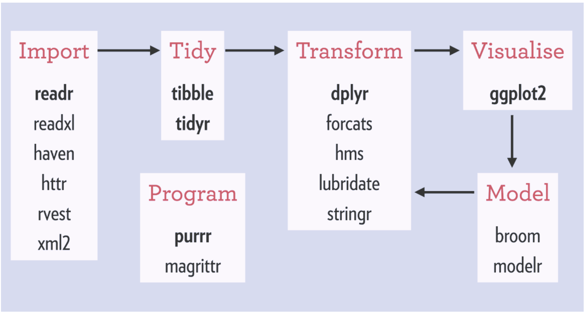

--- 
title: "R_Dplyr_minicourse"
author: "陳柏銘PoMingChen"
date: "`r Sys.Date()`"
description: E.Major R_Dplyr_minicourse
documentclass: ctexbook
geometry:
- b5paper
- tmargin=2.5cm
- bmargin=2.5cm
- lmargin=3.5cm
- rmargin=2.5cm
link-citations: yes
lof: yes
lot: yes
site: bookdown::bookdown_site
colorlinks: yes
---

```{r setup, include=FALSE}
options(
  htmltools.dir.version = FALSE, formatR.indent = 2, width = 55, digits = 4
)

lapply(c(), function(pkg) {
  if (system.file(package = pkg) == '') install.packages(pkg)
})

knitr::opts_chunk$set(message=FALSE,
                      echo=FALSE,
                      fig.showtext=TRUE)
library(showtext)
showtext_auto()
```

# 課程規劃 

<div class="alert white">
dplyr在tidyverse系列的定位<a data-toggle="collapse" href="#collapseExample" role="button" aria-expanded="false" aria-controls="collapseExample"><i class="fa fa-image"></i></a>
</div>

```{r, eval=TRUE, echo=FALSE}
library(htmltools)
HTML('
<div class="collapse" id="collapseExample">
<h3>第一部分</h3>

</div>
     ')
```

## 前言 {-}   

Dplyr是R語言當中相當重要的資料處理與轉換(Data Transformation)套件，同時也是跨出探索式資料分析的第一步。

探索式資料分析是透過視覺化或敘述統計的方式，去觀察資料本身的特性或者變數與變數之間的關聯，以求對資料有更多的認識，看看是否有意外有趣的發現或者不符合常理的地方。當然也包含資料清理與建立新變數特徵 (features) 等部分，必要時需透過爬蟲或者引入第三方資料，才算完整。

資料處理做得好，整體的分析方向和後面的統計建模才會有意義且往對的道路前進，以避免不必要的時間、資源浪費。

## 課前要求 {-}  

1. 安裝：R and R Studio Desktop: https://www.rstudio.com  
2. [下載dplyr cheatsheet](https://github.com/rstudio/cheatsheets/raw/master/data-transformation.pdf) 
3. 註冊[Github](https://github.com)
4. 用Github帳戶登入右下角gitter open chat聊天室

## 課程大綱 {-} 

本課程將逐步介紹Dplyr裡常見的函數，主要會透過R語言內建的`nycflights13`，以及`mtcars`資料集做教學與課堂上練習。自主練習部分則是利用美國職籃NBA2017~2018球季的球員統計資料做簡單的資料探索。

課堂範例`mtcars`與自主練習`NBA1718`皆無提供程式碼答案，前者請於課堂上透過gitter open chat貼上寫好的程式碼，也藉此了解大家的學習狀況。後者可以有空時玩一玩，貼在gitter，歡迎大家一起討論成長。

> join (合併報表) 是Dplyr中相當重要的一環，但因初期使用時機不多，所以有興趣可以自行參考cheatsheet。取代地，補充了tidyr套件裡面常用的gather/spread，用來轉換資料行列排版的函數。

以下為講解內容順序：

1. 認識資料基本資訊

  - `?`、`head`、`str`、`rename`
  
2. 計算敘述統計量

  - `summarise`

3. 挑選適當的欄位

  - `select`

4. 篩選適當觀察值

  - `filter`

5. 從既有變數產生新變數

  - `mutate`

6. 排序觀察值

  - `arrange`
  
7. 分群分析

  - `group_by`
  
8. 其他

  - `gather/spread`
